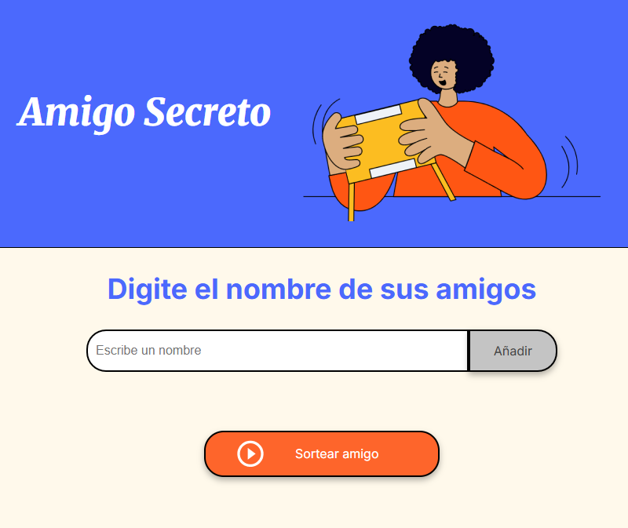

# Challenge Amigo Secreto

Amigo Secreto

- Para este desafío, desarrollé una aplicación que permita al usuario, ingresar, en un a lista, nombres de amigos para realizar un sorteo aleatorio y determinar quién será el  **"amigo secreto"**.

- El usuario podrá agregar nombres a medida que vaya digitando em el campo de texto y posteriormente haciendo clic en el botón **"Añadir"**, estos nombres se mostrarán en el centro de la página; una vez ingresado todos los nombres, el usuario, al hacer clic en el botón **"Sortear amigo"** se mostrará el resultado del sorteo, en forma aleatoria, mostrando el nombre en pantalla. 

## Características:

- **Escribir y agrgar nombres:** El usuario escribirá el nombre de sus amigos, uno por uno, un amigo en un campo de texto y lo agregarán a una lista al hacer clic en el botón  **"Añadir"**.

- **Validación de entrada:** Si el campo de texto está vacío, y se presiona el botón **"Añadir"**, se mostrará un cuadro de alerta pidiendo ingresar un nombre; y si se presiona el botón **"Sortear amigo"**, el programa pedirá que al menos se agregue un nombre para poder realizar el sorteo.

- **Visualización de los nombres ingresados:** Los nombres ingresados aparecerán en una lista debajo del campo de entrada.

- **Sorteo aleatorio:** Al hacer clic en el botón **"Sortear Amigo",** el programa seleccionará de manera aleatoria un nombre de la lista y se mostrará en la página junto con el siguiente mensaje **"El amigo secreto sorteado es:"**.

## Desarrollado por: 
@Jarel79